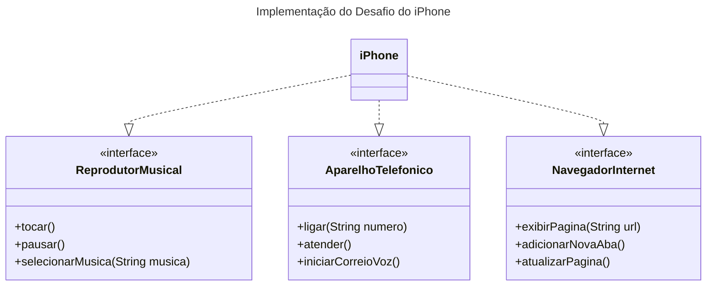

## Desafio UML - iPhone

Esse é o projeto para resolução do desafio de Controle de Fluxo (https://github.com/digitalinnovationone/trilha-java-basico/blob/main/desafios/poo)

Utilizei a ferramenta Mermaid para a criação do Diagrama UML.

Segue a resolução do desafio

### Link direto do site do Mermaid

### Código Markdown do Mermaid

