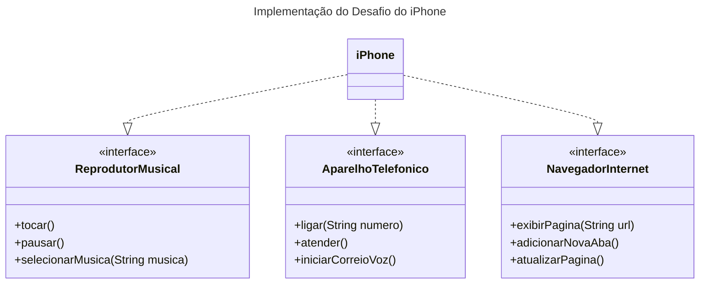

## Desafio UML - iPhone

Esse é o projeto para resolução do desafio de Controle de Fluxo (https://github.com/digitalinnovationone/trilha-java-basico/blob/main/desafios/poo)

Utilizei a ferramenta Mermaid para a criação do Diagrama UML.

Segue a resolução do desafio.

### Link direto do site do Mermaid

### Código Markdown do Mermaid

## Implementação

Defini as interfaces conforme o desafio e implementei a classe iPhone.

Para testar, criei a classe UsuarioiPhone.
Apresento um menu com as opções que o usuário pode escolher e baseado nessa opção, faço a chamada do respectivo método na classe iPhone.
Utilizei a classe Scanner para fazer a leitura da entrada.

Segue o menu apresentado para o usuário

Escolha a ação do iPhone
1 - Tocar música
2 - Pausar música
3 - Selecionar música
4 - Fazer ligação telefônica
5 - Atender ligação telefônica
6 - Iniciar correio de voz
7 - Exibir página Web
8 - Adicionar nova aba no navegador
9 - Atualizar página do navegador
X - Sair do programa
